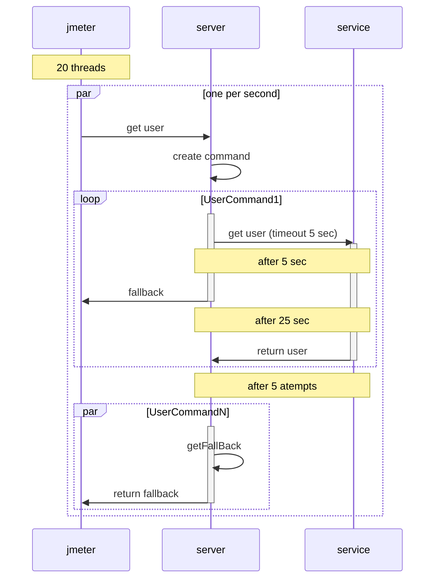

```mermaid
   sequenceDiagram;
        participant jmeter
        participant server
        participant service
        note over jmeter: 20 threads
        par one per second
          jmeter ->> server: get user
          server ->> server: create command 
          loop UserCommand1
            activate server
            server ->> service: get user (timeout 5 sec)
            activate service
            note over server, service: after 5 sec
            server ->> jmeter: fallback
            deactivate server
            note over server, service: after 25 sec
            service ->> server: return user
            deactivate service
        
          end
          note over server,service: after 5 atempts
          par UserCommandN
            activate server
            server ->> server: getFallBack
            server ->> jmeter: return fallback
            deactivate server
          end
          
         
        end
```
