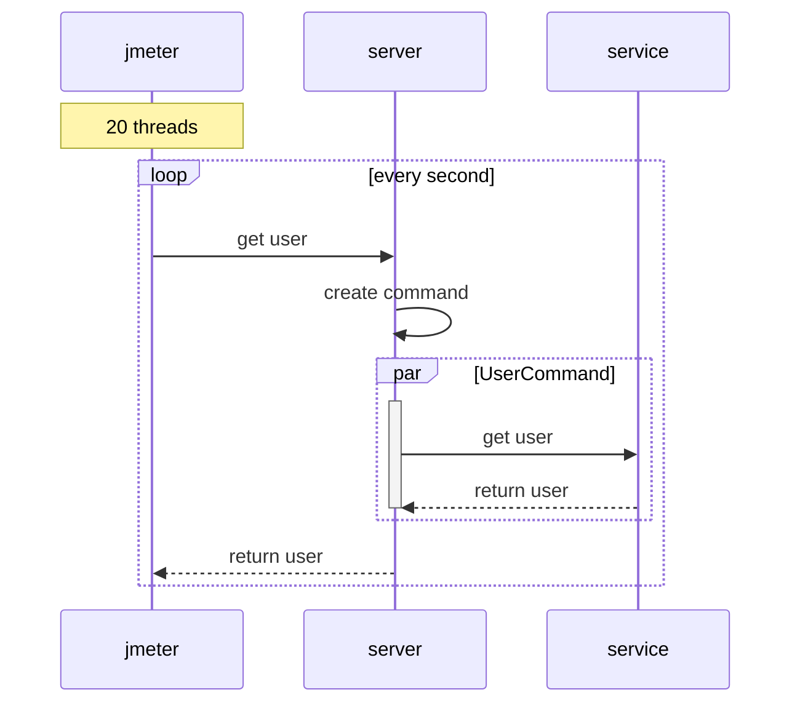

```mermaid
   sequenceDiagram;
        participant jmeter
        participant server
        participant service
        note over jmeter: 20 threads
        loop every second
          jmeter ->> server: get user
          server ->> server: create command 
          par UserCommand
            activate server
            server ->> service: get user
            service -->> server: return user
            deactivate server
          end
          server -->> jmeter: return user
        end
```
